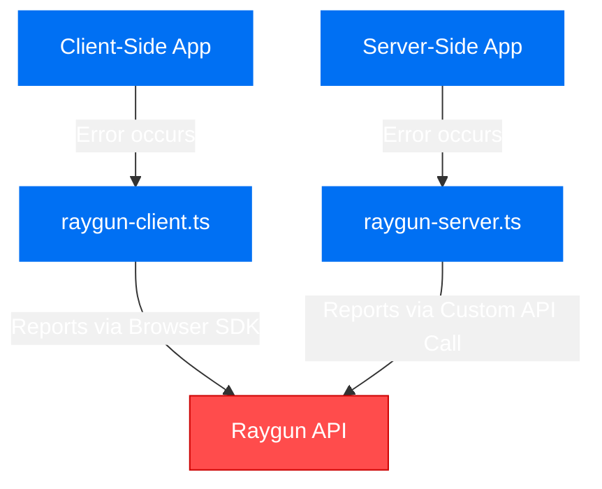

<p align="center">
  
</p>

## Overview

This demo application showcases how to implement Raygun error tracking in a Next.js application running on Bun. It demonstrates both client-side and server-side error reporting using environment variables for configuration.

## Architecture

The application demonstrates a modern approach to error tracking in Next.js applications:



## Key Features

- **Client-side error tracking** using the Raygun Browser SDK
- **Server-side error tracking** using custom fetch implementation for Server Actions
- **Environment variable configuration** for secure API key management
- **Bun runtime support** for improved development experience

## Setup

1. Clone this repository
2. Create `.env.local` file with your Raygun API key:
   ```bash
   cp .env.example .env.local
   ```
   Edit the `.env.local` file with your Raygun API key:
   ```
   NEXT_PUBLIC_RAYGUN_API_KEY=your_api_key_here
   ```
3. Install dependencies:
   ```bash
   bun install
   ```
4. Run the development server:
   ```bash
   bun run dev
   ```
5. Open http://localhost:3000 to view the application

## Implementation Details

### Server-Side Error Tracking

Instead of using the Raygun SDK (which has compatibility issues with Next.js Server Actions), this demo implements a custom solution in `app/actions/raygun-server.ts` that makes direct API calls to Raygun.

### Client-Side Error Tracking

Client-side error tracking is implemented in two ways:

1. Inline script in `app/layout.tsx` for global error tracking
2. Dynamic loading in `app/utils/raygun-client.ts` for more advanced use cases

### Environment Variables

All Raygun API keys are stored in environment variables:

- `NEXT_PUBLIC_RAYGUN_API_KEY` - accessible from both client and server

## Usage Examples

### Triggering a Test Error

The application includes functions to test both client and server error reporting:

```javascript
// Client-side error test
import { sendRaygunClientError } from "@/app/utils/raygun-client";
sendRaygunClientError(new Error("Test client error"));

// Server-side error test
import { triggerServerError } from "@/app/actions/raygun-server";
await triggerServerError();
```
